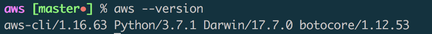
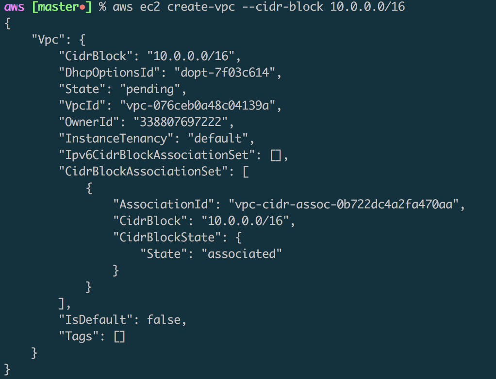
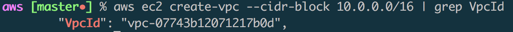

## AWS command Line
본 문서는 hands-on에 가까운 문서이며 IaC(Infrastructure as code)에 따라서 테스트한 내용 입니다.

---
### reference link
- [AWS CLI install](https://docs.aws.amazon.com/ko_kr/cli/latest/userguide/cli-install-macos.html#awscli-install-osx-path)
- [AWS CLI configure](https://docs.aws.amazon.com/ko_kr/cli/latest/userguide/cli-chap-getting-started.html#cli-quick-configuration)
- [AWS CLI Command Reference](https://docs.aws.amazon.com/cli/latest/reference/ec2/index.html#cli-aws-ec2)

---
### AWS CLI install
AWS CLi install (python3.7 설치 완료한 상태)
* 환경변수 등록은 아래에 내용 추가 하였습니다. (mac 기준)
- [get-pip.py](get-pip.py)
```
curl -O https://bootstrap.pypa.io/get-pip.py
python3 get-pip.py --user
pip3 install awscli --upgrade --user
aws --version
```

* bash 사용시
```
echo 'export PATH="/Users/$(whoami)/Library/Python/3.7/bin:$PATH"' >> .bashrc
```
* zsh 사용시
```
echo 'export PATH="/Users/$(whoami)/Library/Python/3.7/bin:$PATH"' >> .zshrc
```

---
### AWS EC2 기본 설정
EC2를 이용한 인프라 환경 구축에 따른 IaC 원칙을 테스트를 진행한 내용 입니다. (IAM를 이용한 테스트 계정의 policy는 administratorAccess 설정.)

#### infra 생성 과정.
```
aws ec2 create-vpc --cidr-block 10.0.0.0/16 #output 내용에서 Vpc-Id를 기재한다.
```

output 내용에 너무 많아서 노출되는 형식을 linux의 grep 명령어 처럼 사용이 가능할까.?
```
aws ec2 create-vpc --cidr-block 10.0.0.0/16 | grep VpcId
```

이후 진행되는 과정은 별도의 이미지 없이 명령어로 대체하도록 하겠습니다.  (모든 진행 과정에서는 출력된 ID를 꼭 별도 기재해 놓아야 합니다.(고유값))

* VPC 만들기
```
aws ec2 create-vpc --cidr-block 10.0.0.0/16
```
* 서브넷 만들기
```
aws ec2 create-subnet --vpc-id vpc-07743b12071217b0d --cidr-block 10.0.1.0/24
aws ec2 create-subnet --vpc-id vpc-07743b12071217b0d --cidr-block 10.0.2.0/24
```
* 인터넷 게이트웨이 만들기 & VPC 연결 & route table 만들기 및 설정
```
aws ec2 create-internet-gateway
aws ec2 attach-internet-gateway --vpc-id vpc-07743b12071217b0d --internet-gateway-id igw-0d08f0dee042dd80c
aws ec2 create-route --route-table-id rtb-0d1fddb5b4b52e4db --destination-cidr-block 0.0.0.0/0 --gateway-id igw-0d08f0dee042dd80c #route table 의 모든 트래픽(0.0.0.0/0)인터넷 게이트웨이를 가리키는 설정.
aws ec2 describe-route-tables --route-table-id rtb-0d1fddb5b4b52e4db
aws ec2 describe-subnets --filters "Name=vpc-id,Values=vpc-07743b12071217b0d" --query 'Subnets[*].{ID:SubnetId,CIDR:CidrBlock}' #서브넷 ID확인하기 위한 명령문으로 많은 응용이 가능해 보인다.
aws ec2 associate-route-table  --subnet-id subnet-075a4fc49e0b72c9d --route-table-id rtb-0d1fddb5b4b52e4db #해당 서브넷을 퍼블릭 서브넷 으로 지정.
aws ec2 modify-subnet-attribute --subnet-id subnet-075a4fc49e0b72c9d --map-public-ip-on-launch #퍼블릭 IP주소를 자동으로 받도록 설정
```