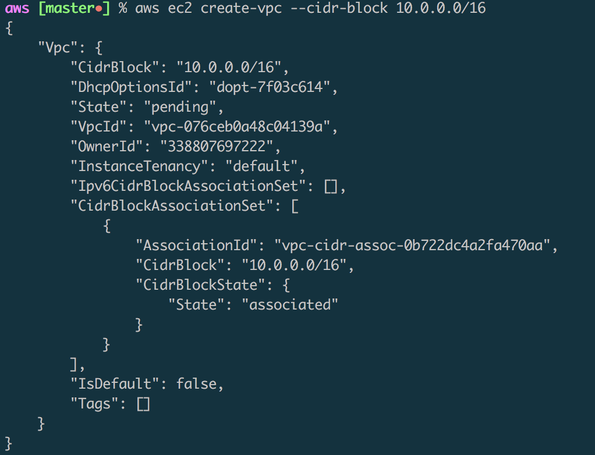
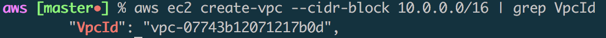
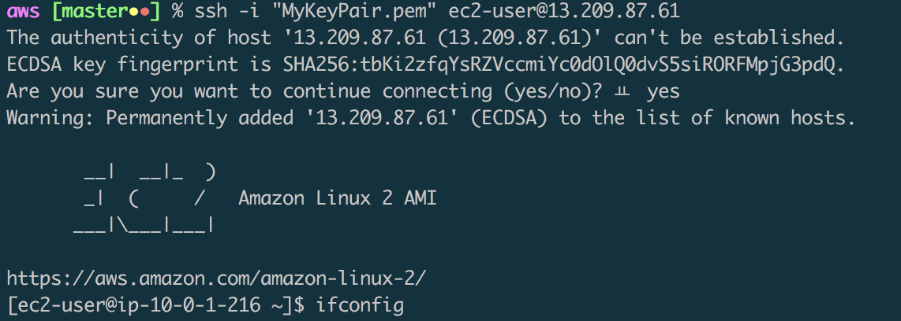
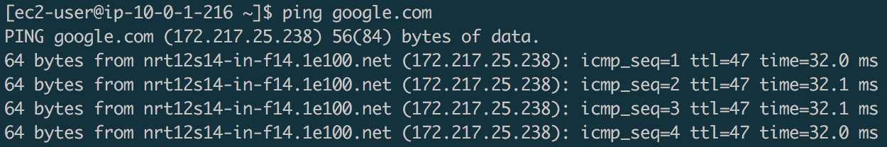

## AWS command Line
본 문서는 hands-on에 가까운 문서이며 IaC(Infrastructure as code)에 따라서 테스트한 내용 입니다.

---
### reference link
- [AWS CLI install](https://docs.aws.amazon.com/ko_kr/cli/latest/userguide/cli-install-macos.html#awscli-install-osx-path)
- [AWS CLI configure](https://docs.aws.amazon.com/ko_kr/cli/latest/userguide/cli-chap-getting-started.html#cli-quick-configuration)
- [AWS CLI Command Reference](https://docs.aws.amazon.com/cli/latest/reference/ec2/index.html#cli-aws-ec2)
- [AWS CLI EC2 infra setup](https://docs.aws.amazon.com/ko_kr/vpc/latest/userguide/vpc-subnets-commands-example.html)

---
### AWS CLI install
AWS CLi install (python3.7 설치 완료한 상태)
* 환경변수 등록은 아래에 내용 추가 하였습니다. (mac 기준)
- [get-pip.py](get-pip.py)
```
curl -O https://bootstrap.pypa.io/get-pip.py
python3 get-pip.py --user
pip3 install awscli --upgrade --user
aws --version
```

* bash 사용시
```
echo 'export PATH="/Users/$(whoami)/Library/Python/3.7/bin:$PATH"' >> .bashrc
```
* zsh 사용시
```
echo 'export PATH="/Users/$(whoami)/Library/Python/3.7/bin:$PATH"' >> .zshrc
```

---
### AWS EC2 기본 설정
EC2를 이용한 인프라 환경 구축에 따른 IaC 원칙을 테스트를 진행한 내용 입니다. (IAM를 이용한 테스트 계정의 policy는 administratorAccess 설정.)

#### infra 생성 과정.
```
#output 내용에서 Vpc-Id를 기재한다.
aws ec2 create-vpc --cidr-block 10.0.0.0/16
```

output 내용에 너무 많아서 노출되는 형식을 linux의 grep 명령어 처럼 사용이 가능할까.?
```
aws ec2 create-vpc --cidr-block 10.0.0.0/16 | grep VpcId
```

이후 진행되는 과정은 별도의 이미지 없이 명령어로 대체하도록 하겠습니다.  (모든 진행 과정에서는 출력된 ID를 꼭 별도 기재해 놓아야 합니다.(고유값))

* VPC 만들기
```
aws ec2 create-vpc --cidr-block 10.0.0.0/16
```
* 서브넷 만들기
```
aws ec2 create-subnet --vpc-id vpc-07743b12071217b0d --cidr-block 10.0.1.0/24
aws ec2 create-subnet --vpc-id vpc-07743b12071217b0d --cidr-block 10.0.2.0/24
```
* 인터넷 게이트웨이 만들기 & VPC 연결 & route table 만들기 및 설정
```
aws ec2 create-internet-gateway
aws ec2 attach-internet-gateway --vpc-id vpc-07743b12071217b0d --internet-gateway-id igw-0d08f0dee042dd80c
#route table 의 모든 트래픽(0.0.0.0/0)인터넷 게이트웨이를 가리키는 설정.
aws ec2 create-route --route-table-id rtb-0d1fddb5b4b52e4db --destination-cidr-block 0.0.0.0/0 --gateway-id igw-0d08f0dee042dd80c
aws ec2 describe-route-tables --route-table-id rtb-0d1fddb5b4b52e4db
#서브넷 ID확인하기 위한 명령문으로 많은 응용이 가능해 보인다.
aws ec2 describe-subnets --filters "Name=vpc-id,Values=vpc-07743b12071217b0d" --query 'Subnets[*].{ID:SubnetId,CIDR:CidrBlock}'
#해당 서브넷을 퍼블릭 서브넷 으로 지정.
aws ec2 associate-route-table  --subnet-id subnet-075a4fc49e0b72c9d --route-table-id rtb-0d1fddb5b4b52e4db
#퍼블릭 IP주소를 자동으로 받도록 설정
aws ec2 modify-subnet-attribute --subnet-id subnet-075a4fc49e0b72c9d --map-public-ip-on-launch
```
* 퍼블릭 서브넷에서 인스턴스 시작

```
aws ec2 create-key-pair --key-name MyKeyPair --query 'KeyMaterial' --output text > MyKeyPair.pem
chmod 400 MyKeyPair.pem
# VPC 보안그룹 만들기 && Access 허용 규칙 설정
aws ec2 create-security-group --group-name SSHAccess --description "Security group for SSH access" --vpc-id vpc-07743b12071217b0d
aws ec2 authorize-security-group-ingress --group-id sg-0ffda041af73b8142 --protocol tcp --port 22 --cidr 0.0.0.0/0
#인스턴스 생성
aws ec2 run-instances --image-id ami-0b4fdb56a00adb616 --count 1 --instance-type t2.micro --key-name MyKeyPair --security-group-ids sg-0ffda041af73b8142 --subnet-id subnet-075a4fc49e0b72c9d
#인스턴스 정보 확인.
aws ec2 describe-instances --instance-id i-04b14a19a42fdf1de
```
확인된 인스턴스 정보를 이용한 SSH접근
```
ssh -i "MyKeyPair.pem" ec2-user@13.209.87.61
```


AWS Console 확인.


---

정리.
1. 인스턴스 확인 및 삭제
```
aws ec2 terminate-instances --instance-ids
```
2. 보안 그룹 삭제
```
aws ec2 delete-security-group --group-id
```
3. 서브넷 삭제
```
aws ec2 delete-subnet --subnet-id
aws ec2 delete-subnet --subnet-id
```
4. 라우터 테이블 삭제
```
aws ec2 delete-route-table --route-table-id
```
5. VPC에서 인터넷 게이트웨이 분리
```
aws ec2 detach-internet-gateway --internet-gateway-id --vpc-id
```
6. 인터넷 게이트 웨이 삭제
```
aws ec2 delete-internet-gateway --internet-gateway-id
```
7. VPC 삭제
```
aws ec2 delete-vpc --vpc-id
```

---

AWS EC2의 관리대장 및 리소스관리를 진행할 경우에는 위의 리소스 생성 이후 하나하나의 Id를 기재할수가 없을것으로 생각되어 리소스를 파악할수 있는 스크립트를 추가로 작성해 보았습니다.